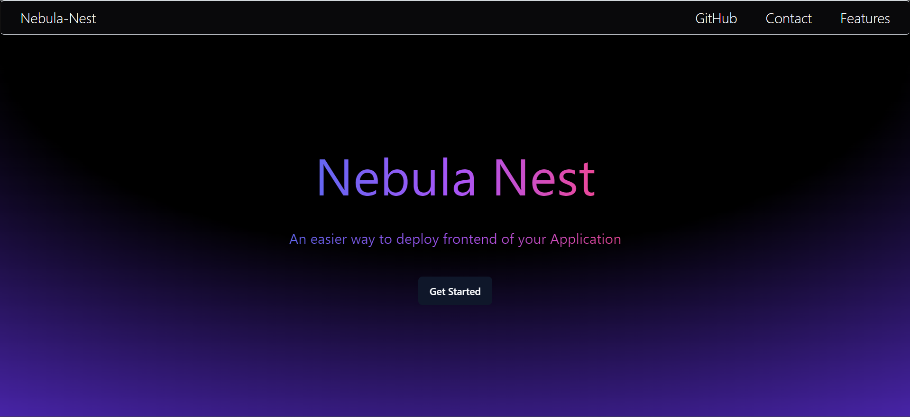
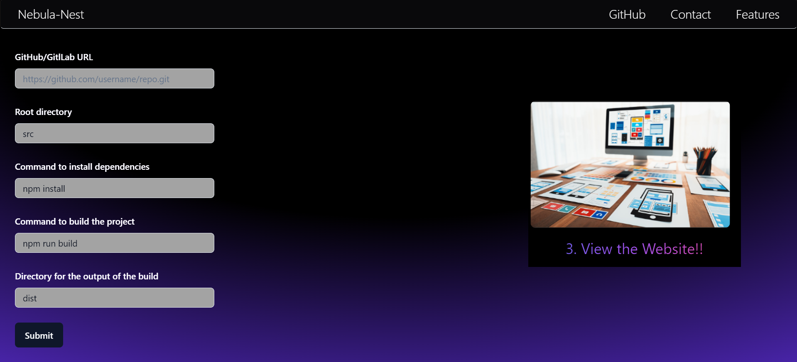
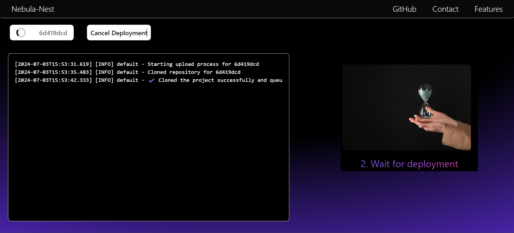
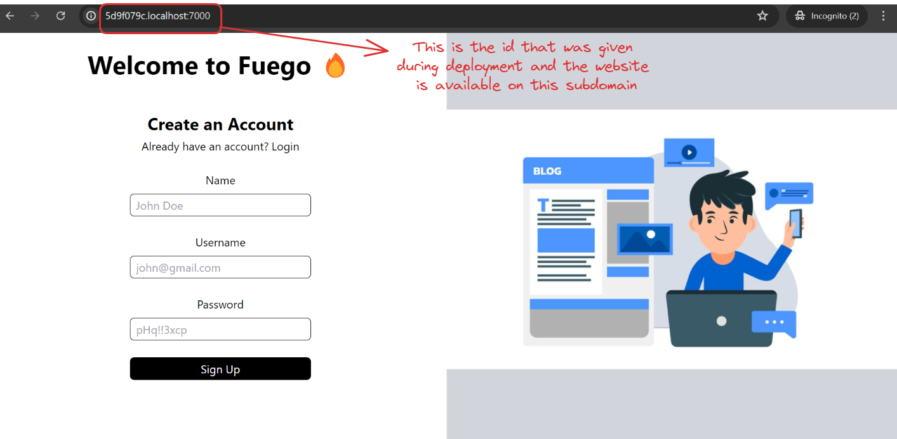

# Nebula-Nest

This project provides a simple way to deploy the frontend of the applications. 

## Getting Started
- Clone the project into your local system using the comand:
```
git clone https://github.com/<your-username>/Nebula-Nest.git
```
- Change the directory to `Nebula Nest`.
- Rename ``.env.example`` to ``.env`` and fill the required details.
### For the database
- Navigate to ``db/`` and rename ``.env.local.example`` to ``.env`` and fill the database URL.
- Run `npm install` and then run `npx prisma migrate dev --name <commit-message>` to migrate the database and `npx prisma generate` to generate the Prisma Client.

### For the servers
- Rename ``.env.example`` to ``.env`` and fill the required details.
- Run the command `./start.sh` to install the dependencies and start all the 3 servers.
- Run `./stop.sh` to stop all the servers.

### For the frontend
- Go into `frontend/` directory.
- Run ``npm install`` to install the dependencies and then run ``npm run dev`` to start the frontend.


## Screenshots
**HOME PAGE** <br />



**DETAILS PAGE** (where you can set the configuration for the project) <br />



**DEPLOYMENT LOGS** <br />



**DEPLOYED FRONTEND** <br />



## Tech Stack
### Frontend
- React as the web framework.
- Tailwind CSS and ShadCN UI for styling.
### Backend
- NodeJS + Express as the primary stack.
- AWS / Cloudflare for cloud infrastructure.
- PostgreSQL as the database.
- RabbitMQ for message queueing.
- Docker for sandboxing.

## License
The project is licensed under MIT License.