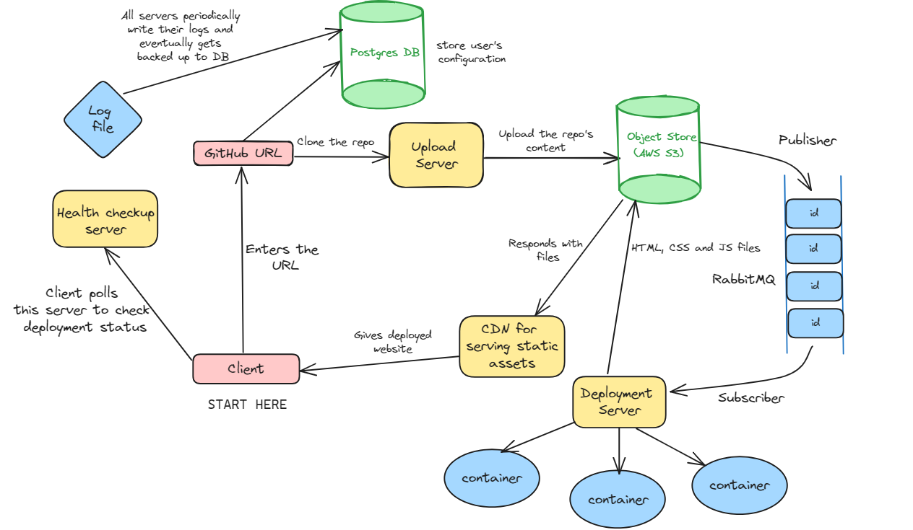

# System Design of the Project

## Upload Server
- The user enters the project's GitHub URL and then the necessary files get downloaded from GitHub.
- Check the size of the repository being downloaded and if it is more than 1GB then it cannot be downloaded.
- A unique ``id`` of the project is generated which helps user keep track of their project throughout the entire process.
- After the successful download all the different static and dynamic files will be uploaded to AWS S3 and deleted from the server.
- After a project's contents are put in S3, the projects' ``id`` is pushed into a queue. This is the publisher in the queue.

## Deployment Server
- Deployment is an expensive operation as here all the frontend code is converted to native HTML, CSS and JS which can be understood by the browser.
- Hence whenever deployment server is free, it pops the ``id`` from the queue and builds the project. This acts as the subscriber in the queue. Hence queue acts as a shock absorber and doesn't overload the deployment server.
- Building process is run inside a docker container for security reasons. Server can spin containers up and down at it's will.
- The converted files are sent back to S3 for storage.

## Request-Response Server
- After deployment is complete, the server retrieves the files from S3 and sends it to client.

## PotgreSQL
- Will store the user's project configuration details like the output folder, the build command, package manager etc.